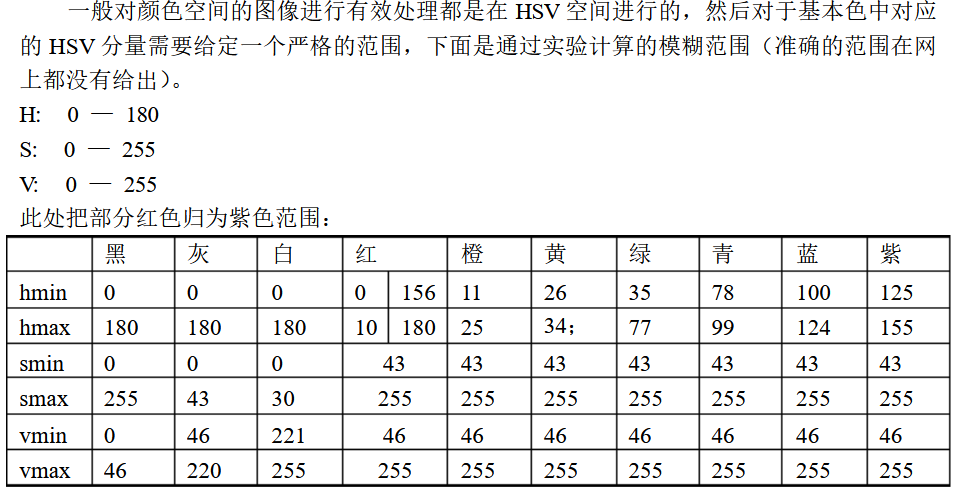

<font color = "HotPink">色调H</font>
用角度度量，取值范围为0°～360°，从红色开始按逆时针方向计算，红色为0°，绿色为120°,蓝色为240°。它们的补色是：黄色为60°，青色为180°,品红为300°

<font color = "HotPink">饱和度S</font>
饱和度S表示颜色接近光谱色的程度。一种颜色，可以看成是某种光谱色与白色混合的结果。其中光谱色所占的比例愈大，颜色接近光谱色的程度就愈高，颜色的饱和度也就愈高。饱和度高，颜色则深而艳。光谱色的白光成分为0，饱和度达到最高。通常取值范围为0%～100%，值越大，颜色越饱和

<font color = "HotPink">明度V</font>
明度表示颜色明亮的程度，对于光源色，明度值与发光体的光亮度有关；对于物体色，此值和物体的透射比或反射比有关。通常取值范围为0%（黑）到100%（白）

## HSV表


<font color = "DarkOrchid">如果想用的颜色不在HSV表里可以去查想要的颜色色号的rgb值，然后用`cv2.cvtcolor()`函数将bgr转成hsv
例如：
```Python
color = np.uint8([[[203, 192, 255]]])
hsv = cv2.cvtColor(color, cv2.COLOR_BGR2HSV)
```  

## 完整代码(视频中)
```Python
import numpy as np
import cv2

font = cv2.FONT_HERSHEY_SIMPLEX
lower_green = np.array([35, 110, 106])
upper_green = np.array([77, 255, 255])

cap = cv2.VideoCapture('F:/test/mp4.mp4')
if cap.isOpened():
    flag = 1
else:
    flag = 0
num = 0
if flag:
    while True:
        ret, frame = cap.read()

        if not ret:
            break
        hsv_img = cv2.cvtColor(frame, cv2.COLOR_BGR2HSV)
        mask_green = cv2.inRange(hsv_img, lower_green, upper_green)

        mask_green = cv2.medianBlur(mask_green, 7)
        mask_green, contours, hierarchy = cv2.findContours(mask_green, cv2.RETR_EXTERNAL, cv2.CHAIN_APPROX_NONE)

        for cnt in contours:
            (x, y, w, h) = cv2.boundingRect(cnt)
            cv2.rectangle(frame, (x, y), (x + w, y + h), (0, 255, 255), 2)
            cv2.putText(frame, "Green", (x, y - 5), font, 0.7, (0, 255, 0), 2)

        num = num + 1
        cv2.imshow("dection", frame)
        cv2.imwrite("imgs/%d.jpg" % num, frame)
        if cv2.waitKey(20) & 0xFF == 27:
            break
cv2.waitKey(0)
cv2.destroyAllWindows()
```
