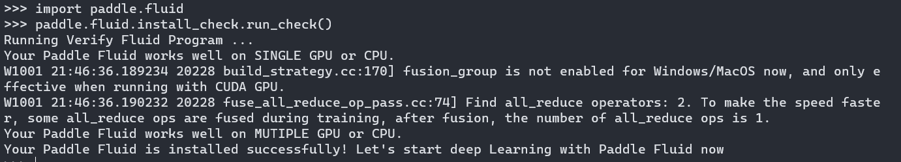

# Solving environment: failed with initial frozen solve.Retrying with flexible solve  
用conda装paddle的时候出现了这个报错  
## 解决方法  
`conda update -n base conda`    
`conda update --all`    
<font color="BlueViolet">然后如果还是不行，就再加一行（但实际上大部分情况这样就可以了）</font>  
`conda update --prefix`  
会自己跳出来一段后面的目录，不用管它回车就行了，然后常规操作，我挑出来过是否允许python.exe都点允许，然后命令行出现y/n就都填y就好，完成后再一次`conda update --all`  
最后安装好之后，尝试一下进入python解释器，输入
```
  import paddle.fluid
  paddle.fluid.install_check.run_check()
```
出现如下图就成功了

