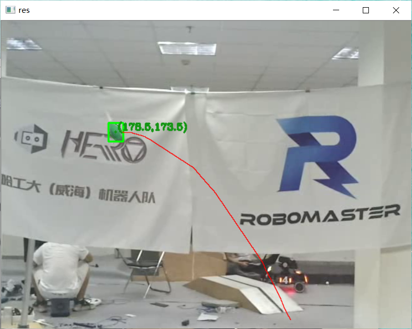

# 卡尔曼Kalman滤波跟踪
kalman滤波：  
1.用上一次的最优状态估计和最优估计误差去计算这一次的先验状态估计和先验误差估计；  
2.用1得到的本次先验误差估计和测量噪声，得到卡尔曼增益；  
3.用1，2步骤得到所有先验误差估计和测量噪声，得到本次的最优估计。   
<font color="DeepPink">总结：对模型的预测值和实际的观测值进行加权，迭代计算出未来的状态</font>

## 基础
* 卡尔曼的核心：预测＋反馈  
* 卡尔曼滤波算法分为两个阶段：  
  * 预测阶段：卡尔曼滤波器使用由当前点计算的协方差来估计目标的新位置；  
  * 更新阶段：卡尔曼滤波器记录目标的位置，并为下一次循环计算修正协方差。
* 观测数据：可能存在或多或少的误差的采集的实际数据  
* 最优估计：算法计算出来接近于真实值的估计    
* 均方误差：误差（每个估计值与真实值的差）的平方，再求和，再求平均。多样本时，均方误差等于每个样本的误差平方乘以该样本出现的概率，再求和。   
* 方差：描述随机变量的离散程度，具体来说是变量值离期望值的距离。    
* 最小均方误差估计：估计参数，使得估计出来的模型和真实值之间的误差平方期望最小。   
* 两个变量之间的协方差：在协方差矩阵中，对角线元素即为方差。x, y都大于期望，协方差为正值。

## 核心公式
<font color="HotPink">
对于离散控制过程的系统，其系统状态和系统测量值可进行以下表示：    

X(k) = AX(k-1) + BU(k) + W(k)  
Z(k) = HX(k) + V(k)        
</font>

* X(k)： k时刻系统状态
* A: 状态转移矩阵，对应opencv里kalman滤波器的transitionMatrix矩阵
* B: 控制输入矩阵，对应opencv里kalman滤波器的controlMatrix矩阵
* H：系统测量矩阵，对应opencv里kalman滤波器的measurementMatrix矩阵
* U(k)：k时刻对系统的控制量
* Z(k)：k时刻的测量值
* W(k)：系统过程噪声，为高斯白噪声，协方差为Q，对应opencv里的kalman滤波器的processNoiseCov矩阵
* V(k)：测量噪声，也为高斯白噪声，协方差为R，对应opencv里的kalman滤波器的measurementNoiseCov矩阵 

<font color="Crimson">
真正核心的五个公式：    

$X(k|k-1) = AX(k-1|k-1) + BU(k)$  
$P(k|k-1) = AP(k-1|k-1)A^T + Q$     
$Kg(k) = {P(k|k-1)H^T\over HP(k|k-1)H^T + R}$   
$X(k|k) = X(k|k-1) + Kg(k)(Z(k) - HK(k|k-1))$   
$P(k|k) = (1-Kg(k)H)P(k|k-1)$
</font>
* 预测值的计算
  * 式(1)：计算基于k-1时刻状态对k时刻系统状态的预测值
    * X(k|k-1)：基于k-1时刻状态对k时刻状态的预测值，对应opencv里kalman滤波器的predict()输出，即statePre矩阵
    * X(k-1|k-1)：k-1时刻状态的最优结果，对应opencv里kalman滤波器的上一次状态的statePost矩阵
    * U(k)：k时刻的系统控制量，无则为0
    * A：状态转移矩阵，对应opencv里kalman滤波器的transitionMatrix矩阵
    * B：控制输入矩阵，对应opencv里kalman滤波器的controlMatrix矩阵
  * 式(2)：计算X(k|k-1)对应的协方差的预测值
    * P(k|k-1)：   基于k-1时刻的协方差计算k时刻协方差的预测值，对应opencv里kalman滤波器的errorCovPre矩阵
    * P(k-1|k-1)：k-1时刻协方差的最优结果，对应opencv里kalman滤波器的上一次状态的errorCovPost矩阵
    * Q：系统过程噪声协方差，对应opencv里kalman滤波器的processNoiseCov矩阵

* 增益的计算
  * Kg(k)：k时刻的kalman增益，为估计量的方差占总方差(估计量方差和测量方差)的比重，对应opencv里kalman滤波器的gain矩阵
  * H：系统测量矩阵，对应opencv里kalman滤波器的measurementMatrix矩阵
  * R： 测量噪声协方差，对应opencv里的kalman滤波器的measurementNoiseCov矩阵
* k时刻的更新
  * 式(4)：计算k时刻系统状态最优值    
    * X(k|k)：k时刻系统状态的最优结果，对应opencv里kalman滤波器的k时刻状态的statePost矩阵     
    *Z(k)：k时刻系统测量值
  * 式(5)：计算k时刻系统最优结果对应的协方差
    * P(k|k)：k时刻系统最优结果对应的协方差，对应opencv里kalman滤波器的errorCovPost矩阵
* 输出即为X(k|k)，k时刻系统状态最优估计值。 

## 代码
```Python
import cv2
import numpy as np

minGreen = (35, 43, 46)
maxGreen = (77, 255, 255)

stateSize = 6
measSize = 4
coutrSize = 0
kf = cv2.KalmanFilter(stateSize, measSize, coutrSize)
state = np.zeros(stateSize, np.float32)
meas = np.zeros(measSize, np.float32)
procNoise = np.zeros(stateSize, np.float32)


cv2.setIdentity(kf.transitionMatrix)

kf.measurementMatrix = np.zeros((measSize, stateSize), np.float32)
kf.measurementMatrix[0, 0] = 1.0
kf.measurementMatrix[1, 1] = 1.0
kf.measurementMatrix[2, 4] = 1.0
kf.measurementMatrix[3, 5] = 1.0

cv2.setIdentity(kf.processNoiseCov)
kf.processNoiseCov[0, 0] = 1e-2
kf.processNoiseCov[1, 1] = 1e-2
kf.processNoiseCov[2, 2] = 5.0
kf.processNoiseCov[3, 3] = 5.0
kf.processNoiseCov[4, 4] = 1e-2
kf.processNoiseCov[5, 5] = 1e-2

cv2.setIdentity(kf.measurementNoiseCov)

video_cap = cv2.VideoCapture('F:/test/1.mp4')
fps = video_cap.get(cv2.CAP_PROP_FPS)
size = (int(video_cap.get(cv2.CAP_PROP_FRAME_WIDTH)), int(video_cap.get(cv2.CAP_PROP_FRAME_HEIGHT)))
videoWriter = cv2.VideoWriter('F:/2.mp4', cv2.VideoWriter_fourcc('m', 'p', '4', 'v'), fps, size)
ticks = 0
i = 0
found = False
notFoundCount = 0
prePointCen = []
meaPointCen = []
while True:
    ret, frame = video_cap.read()
    if ret is False:
        break
    cv2.imshow('frame', frame)
    cv2.waitKey(1)
    precTick = ticks
    ticks = float(cv2.getTickCount())
    res = frame.copy()
    dT = float((ticks - precTick)/cv2.getTickFrequency())
    if found:
        kf.transitionMatrix[0, 2] = dT
        kf.transitionMatrix[1, 3] = dT

        state = kf.predict()
        width = state[4]
        height = state[5]
        x_left = state[0] - width/2
        y_left = state[1] - height/2
        x_right = state[0] + width/2
        y_right = state[1] + height/2

        center_x = state[0]
        center_y = state[1]
        prePointCen.append((int(center_x), int(center_y)))

    frame = cv2.GaussianBlur(frame, (5, 5), 3.0, 3.0)
    frame = cv2.cvtColor(frame, cv2.COLOR_BGR2HSV)
    rangeRes = cv2.inRange(frame, minGreen, maxGreen)
    kernel = np.ones((3, 3), np.uint8)
    rangeRes = cv2.erode(rangeRes, kernel, iterations=2)
    rangeRes = cv2.dilate(rangeRes, kernel, iterations=2)
    cv2.waitKey(1)
    contours = cv2.findContours(rangeRes.copy(), cv2.RETR_EXTERNAL, cv2.CHAIN_APPROX_NONE)[-2]
    target = []
    Box = []
    for i in range(len(contours)):
        x, y, w, h = cv2.boundingRect(np.array(contours[i]))

        ratio = float(w/h)
        if ratio > 1.0:
            ratio = 1.0 / ratio
        if ratio > 0.75 and w*h >= 400:
            target.append(contours[i])
            Box.append([x, y, w, h])

    for i in range(len(target)):
        cv2.drawContours(res, target, i, (20, 150, 20), 1)
        cv2.rectangle(res, (Box[i][0], Box[i][1]), (Box[i][0]+Box[i][2], Box[i][1]+Box[i][3]), (0, 255, 0), 2)

        center_x = Box[i][0] + Box[i][2] / 2
        center_y = Box[i][1] + Box[i][3] / 2

        meaPointCen.append((int(center_x), int(center_y)))
        cv2.circle(res, (int(center_x), int(center_y)), 2, (20, 150, 20), -1)

        name = "(" + str(center_x) + "," + str(center_y) + ")"
        cv2.putText(res, name, (int(center_x) + 3, int(center_y) - 3), cv2.FONT_HERSHEY_COMPLEX, 0.5, (20, 150, 20), 2)
    n = len(prePointCen)
    for i in range(1, n):
        if prePointCen[i-1] is None or prePointCen[i] is None:
            continue
        cv2.line(res, prePointCen[i-1], prePointCen[i], (0, 0, 255), 1, 4)
    if len(target) == 0:
        notFoundCount += 1

        if notFoundCount >= 100:
            found = False

    else:
        notFoundCount = 0
        meas[0] = Box[0][0] + Box[0][2] / 2
        meas[1] = Box[0][1] + Box[0][3] / 2
        meas[2] = float(Box[0][2])
        meas[3] = float(Box[0][3])

        if not found:
            for i in range(len(kf.errorCovPre)):
                kf.errorCovPre[i, i] = 1
            state[0] = meas[0]
            state[1] = meas[1]
            state[2] = 0
            state[3] = 0
            state[4] = meas[2]
            state[5] = meas[3]

            kf.statePost = state
            found = True

        else:
            kf.correct(meas)  # Kalman修正
            cv2.imshow("res", res)
            cv2.waitKey(1)
    videoWriter.write(res)

cv2.waitKey(0)
cv2.destroyAllWindows()

```

## 运行截图
