# <font color = "Plum">攻防世界逆向新手区</font>
## <font color="DeepPink">open-source</font>

从  
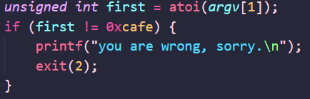  
可知first = 0xcafe  
从  
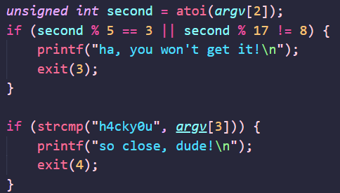  
可知  
<font color = "HotPink">second % 17 = 8
strlen(argv[3]) = strlen("h4cky0u")</font>

所以直接替换到代码里,然后删掉前面多余的就好啦

## <font color="DeepPink">simple-unpack</font>
拿到之后先丢进了ida里，然后<kbd>Shift</kbd>+<kbd>F12</kbd>查找字符串，就看到了
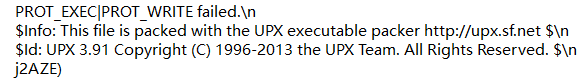  
发现是upx加壳刚准备去脱壳，手一滑就看到了flag
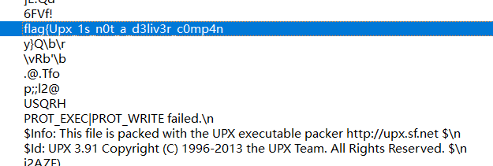

## <font color="DeepPink">logmein</font>
查壳没有
扔进ida里，在main函数里<kbd>F5</kbd>反编译得到
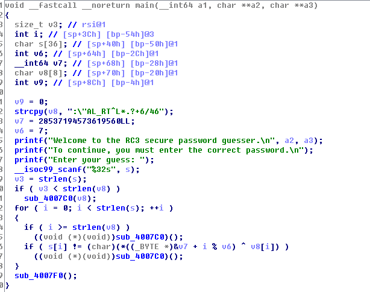  
然后分析发现v7要先转为十六进制（末尾的LL表示长长整型）<font color = "HotPink">65626d61726168</font>  
然后对着ASCII码表得到<font color = "HotPink">ebmarah</font>  
由于x86系列的CPU都是以小端序储存数据的，所以要反过来，  
即<font color = "HotPink">v7=harambe</font>  
看`strcpy(v8, ":\"AL_RT^L*.?+6/46")`  
可知<font color = "HotPink">v8=:\"AL_RT^L*.?+6/46</font>  
然后写个脚本
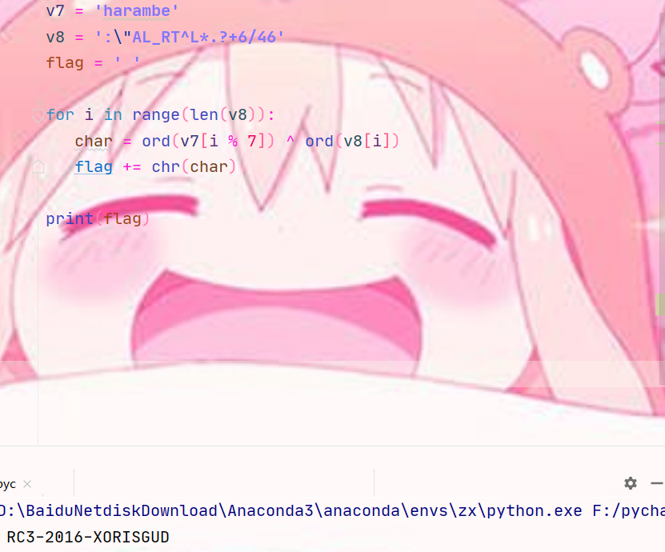
得到的就是flag

## <font color="DeepPink">insanity</font>
查壳没有  
直接扔进ida里查找字符串就找到了，不过这个flag长得奇奇怪怪的

## <font color="DeepPink">getit</font>
扔进ida里看到了s和t的值
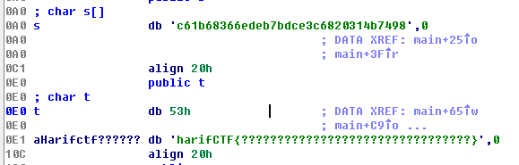  
然后看主函数的代码分析可以发现
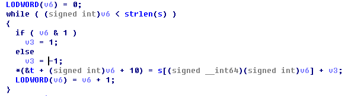  
就是这一段在定义flag的值，所以拿出来复现就出来了
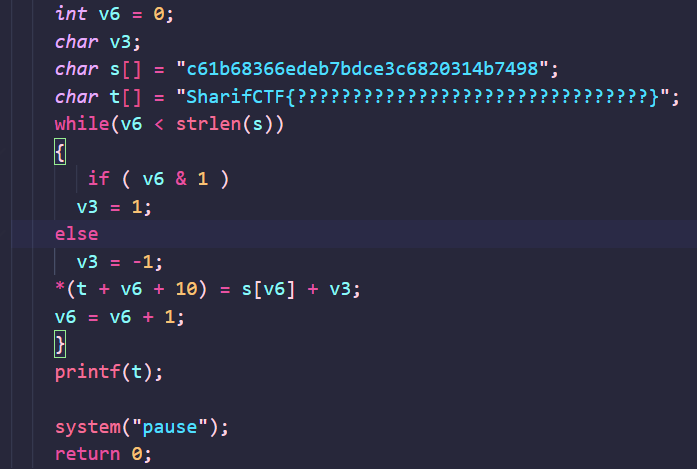
得到flag

## <font color="DeepPink">python-trade</font>
发现是.pyc文件后拿去在线反编译了
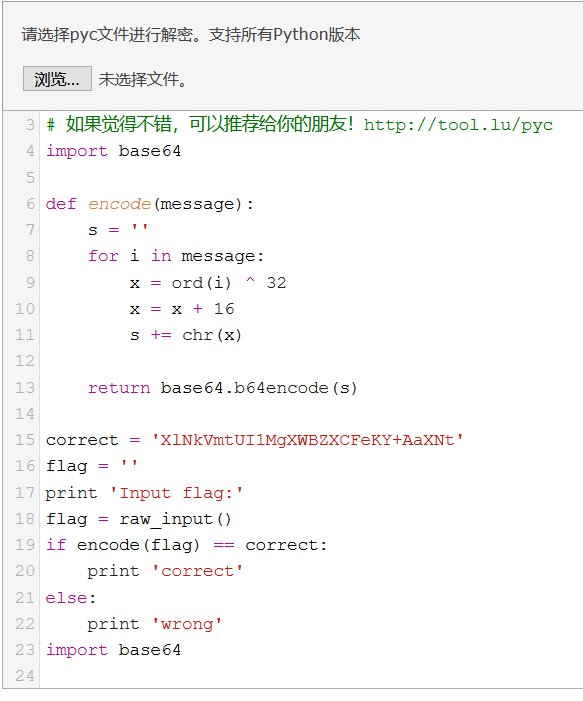  
分析一下倒回去就OK了
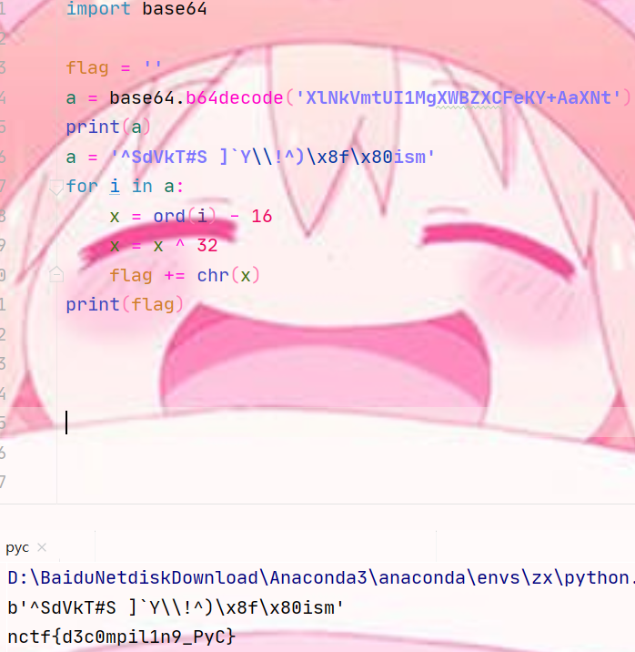

## <font color="DeepPink">game</font>
ida里搜索字符串找到一个<font color = "Pink">done!!! the flag is</font>然后点进对应的函数里，观察就发现这一段就是出flag的
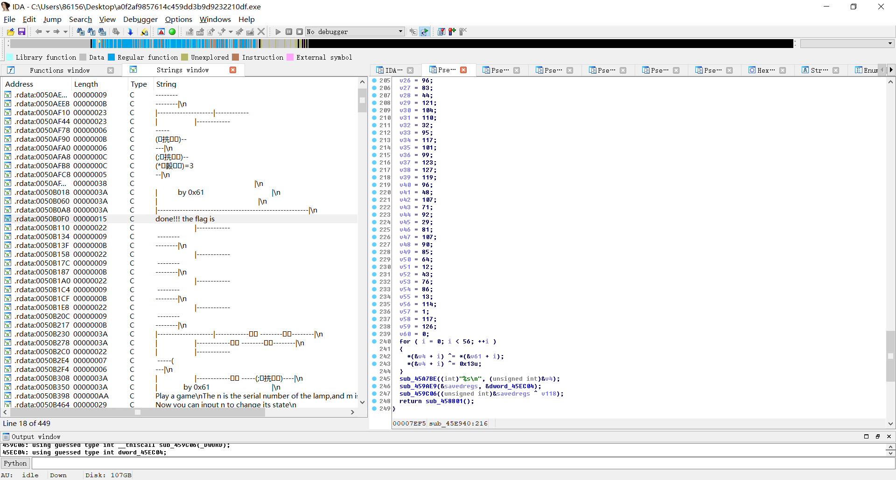
然后写个脚本就出来了
```Python
a1 = [123, 32, 18, 98, 119, 108, 65, 41, 124, 80, 125, 38, 124, 111,  74, 49, 83,
      108, 94, 108, 84, 6, 96, 83, 44, 121, 104, 110, 32, 95, 117, 101, 99, 123,
      127, 119, 96, 48, 107, 71, 92, 29, 81, 107, 90, 85, 64, 12, 43, 76, 86, 13,
      114, 1, 117, 126, 0]
a2 = [18, 64, 98, 5, 2, 4, 6, 3, 6, 48, 49, 65, 32, 12, 48, 65, 31, 78, 62, 32,
      49, 32, 1, 57, 96, 3, 21, 9, 4, 62, 3, 5, 4, 1, 2, 3, 44, 65, 78, 32, 16,
      97, 54, 16, 44, 52, 32, 64, 89, 45, 32, 65, 15, 34, 18, 16, 0]
flag = ''

for i in range(0, 56):
    a1[0 + i] ^= a2[0 + i]
    a1[0 + i] ^= 0x13
    flag = flag + chr(a1[i])

print(flag)
```
## <font color="DeepPink">Hello, CTF</font>
ida里查找字符串然后我注意到了一串特别的数字
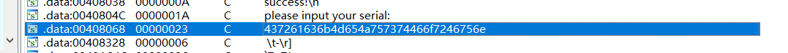
直觉告诉我它应该很关键，就点进去了，然后看到
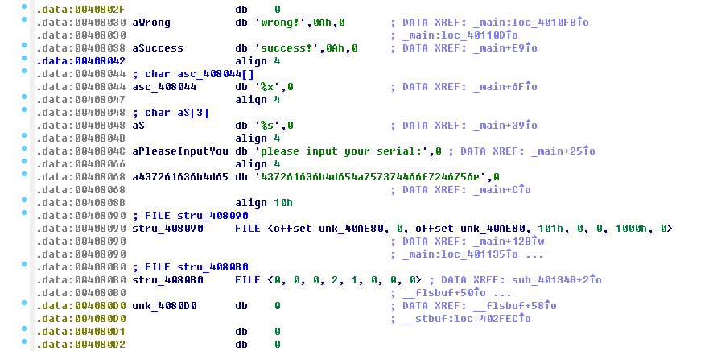
然后看了看反编译后的main函数，我发现这一串其实就是输出的有效结果，根据题目提示不一定是明文，就想它应该是加密了然后就感觉是ASCII码然后出来了一串规律字母<font color = "HotPink">CrackMeJustForFun</font>，就提交显示正确

## <font color="DeepPink">re1</font>
ida第三个打开查找字符串就是结果，或者动态调试

## <font color="DeepPink">no-strings-attached</font>
放进ida里，看main函数，发现`authenticate()`为关键函数，然后去看`authenticate()`，发现flag在`decrypt()`里，然后看汇编代码就发现flag就在eax里，动态调试就可以得到flag了

## <font color="DeepPink">csaw2013reversing2</font>
看main函数的反汇编代码
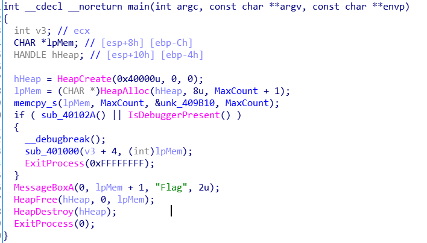
看if那一段可以发现，这一段代码并没有执行，因为如果执行的话，程序是会退出弹不出来弹窗的，看MessageBoxA可以发现flag就在IpMem里，所以要跳进if里，但是也要跳过`__debugbreak()`和`ExitProcess(0xFFFFFFFF)`  
然后去x32dbg动态调试，做出如下修改
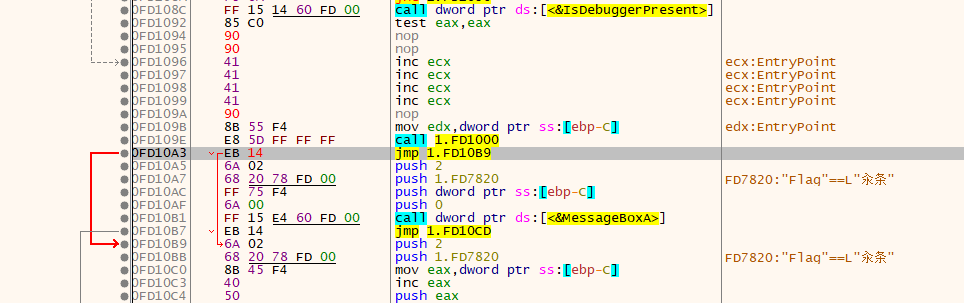
跳到第二个flag的地方，再运行出来的弹窗就是正确的flag

## <font color="DeepPink">maze</font>
  题目描述里说是一个走迷宫的，所以就在想迷宫应该是方方的，由两种不同的什么组合出来的，可能还有两个入口出口的区别。在ida里找的话应该在Hex-View里看，是一段特殊的,就找到了
  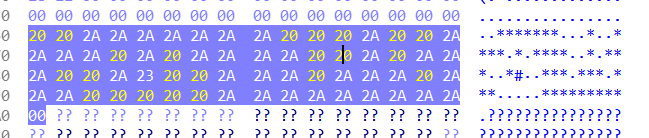
  然后看`main()`函数的反汇编代码
  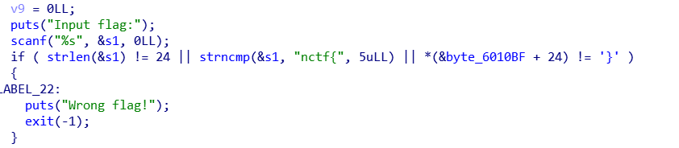
就知道flag应该是<font color="HotPink">nctf{中间字符长度为24}</font>
又看到
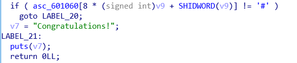  
就可以猜想#对应的23应该是迷宫的终点  
然后看  
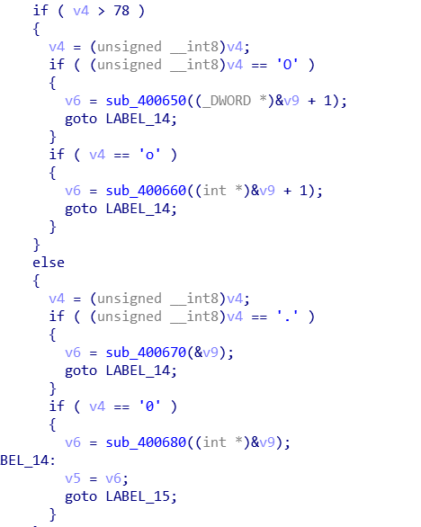  
发现四个关键函数`sub_400650() sub_400660() sub_400670() sub_400680()`分别应该对应左右上下，看函数的内容有<8，所以应该是个8×8矩阵  
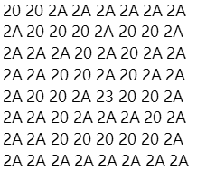  
入口就应该在左上角   
就是<font color="HotPink">右下右右下下左下下下右右右右上上左左</font>，对应就能得到flag为<font color="HotPink">nctf{o0oo00O000oooo..OO}</font>
