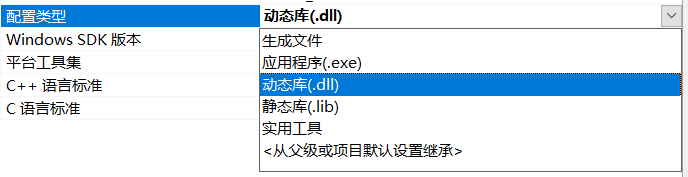

# 生成可供调用的dll推理库
## 编辑好`.cpp`文件
因为是做目标检测所以我在写检测脚本的时候加入图像处理操作，但是没有单独放接口出来
### 添加接口文件  
在头文件中添加接口文件
### 接口函数导出
因为要实现外部调用，所以应给出相应的接口，我使用的是`extern "C" __declspec(dllexport)标记方法`  的方式进行导出的  
<font color =  hotpink>如果是跨语言调用的话，此处注意调用方式的区别，详情参考我的另一篇博客</font>  
[CDLL和WinDLL的区别](/2021/02/06/CDLL和WinDLL的区别/)   

### 修改文件
因为正常的`.cpp`文件编译后是生成`.exe`可执行文件且入口函数为`int main()`，而现在我们是要打包成dll动态推理库，所以我们要将`int main()` 改造成一个可与外部对接的导出函数  
网上这里的教程都不太一样，我尝试了几个方案我都使用不通，就根据自己的情况自行修改了  


## 生成dll文件
### 打开 项目->属性->常规->配置类型->动态库 

### 然后生成

## 测试
在生成的dll文件所在的文件夹下进入powershell，然后执行`Python`命令  
然后依次输入
```Python
    from ctypes import *
    dll = CDLL(dll_path)
    print(dll.derived_function())
```
<font color = Tomato>此处有一些小坑要注意：  
* dll_path最好使用绝对路径
* 你的dll文件所在的目录一定要加到系统环境变量里，不然你一晚上都不会能读到这个dll文件的，血泪教训！！！  :sob: :cupid:
* 当然如果你的dll文件的接口没写好的话也是没法调用的，这个时候就要自行判断问题所在了
  </font>  

## 测试效果 


## 上位机中调用
看我另一篇博客  
[C#写上位机调用dll推理库](/2021/02/06/C%20sharp写上位机调用dll推理库/) 