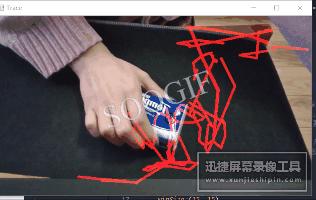

# 运动物体检测+预测运动方向
一开始的时候我想了好久，都觉得好玄学啊，我在运动的时候，可以乱溜达，我想怎么动怎么动，又不是什么规则的运动，都不是什么可以拟合的曲线，那预测位置多奇怪啊,我可能这一秒的趋势是往前运动，但是我突然想不开非要退一下呢qaq，就感觉有点奇怪
## 运动物体检测   
一开始想的是采用背景运动估计的方法去做的，但是在我测试的时候，我固定了摄像头位置，但是由于摄像头好像会自动聚焦然后会有点放大缩小，图像在抖动，而我又是以摄像头读取到的第一帧图像为基础背景去比较的，就导致背景自己就觉得自己在动，就很诡异，效果并不好，代码如下：
```Python
import cv2
import numpy as np
 
cap = cv2.VideoCapture(0)

es = cv2.getStructuringElement(cv2.MORPH_ELLIPSE, (9, 4))
kernel = np.ones((3, 3), np.uint8)
background = None
 
while True:
  ret, frame = cap.read()
  gray_img = cv2.cvtColor(frame, cv2.COLOR_BGR2GRAY)
  gray_img = cv2.GaussianBlur(gray_img, (21, 21), 0)
 
  # 将第一帧设为背景
  if background is None:
    background = gray_img
    continue
  img = cv2.absdiff(background, gray_img)
  img = cv2.threshold(img, 25, 255, cv2.THRESH_BINARY)[1] 
  img = cv2.dilate(img, es, iterations=2)
  # 框选
  contours, hierarchy = cv2.findContours(img.copy(), cv2.RETR_EXTERNAL, cv2.CHAIN_APPROX_SIMPLE)
  for c in contours:
    (x, y, w, h) = cv2.boundingRect(c)
    cv2.rectangle(frame, (x, y), (x+w, y+h), (255, 255, 0), 2)
 
  cv2.imshow('contours', frame)
  cv2.imshow('dis', img)
 
  key = cv.waitKey(30)
    if key == 27:
        break
camera.release()
cv2.destroyAllWindows()
```
然后就改变了想法，采用了光流法，因为很方便就能反馈相邻两帧的相应特征点的坐标，但是缺陷就在于取得特征点有些是无用的  
其中角点检测我参考的博客是：  
[Harris角点检测数学计算过程与CornerHarris方法参数的一点说明【DataWhale学习记录】](https://blog.csdn.net/m0_38052500/article/details/106936075)  
[角点检测详细总结及代码示例](https://blog.csdn.net/xinyuski/article/details/93472253)  
光流法参考的是：  
[SLAM代码（光流法）](https://blog.csdn.net/wendox/article/details/52505971)
## 运动预测
我一开始采取的是取相邻两帧之间的特征点的位置,轨迹就是两点连接起来，预测出的运动方向用向量表示，因为没办法直接在图上画出向量，所以我选择了自己计算一下然后用三条线画一个向量出来  
```python
        x = 10*(x1 - x0) + x0
        y = 10*(y1 - y0) + y0
        x2 = (x - x0)*cmath.sqrt(2)//2 - (y - y0)*cmath.sqrt(2)//2 + x0
        y2 = (x - x0)*cmath.sqrt(2)//2 + (y - y0)*cmath.sqrt(2)//2 + y0
        x3 = (x - x0)*cmath.sqrt(2)//2 + (y - y0)*cmath.sqrt(2)//2 + x0
        y3 = -(x - x0)*cmath.sqrt(2)//2 + (y - y0)*cmath.sqrt(2)//2 + y0
        cv.line(res, (x0, y0), (int(x), int(y)), (0, 0, 139), 2)
        cv.line(res, (int(x), int(y)), (x2, y2), (0, 0, 139), 2)
        cv.line(res, (int(x), int(y)), (x3, y3), (0, 0, 139), 2)
        cv.line(points, (x1, y1), (x0, y0), (0, 0, 255), 3)
        frame = cv.circle(res, (x1, y1), 10, (0, 255, 0))
```
这样算的话就有一个缺陷，如果物体运动速度快一些的话，向量就会画的很大，运动速度的快慢决定了向量大小  
如果非要说圈出预测的物体下一帧所在的位置的话，如下：  
```python
x4 = 2*(x1 - x0) + x0
y4 = 2*(y1 - y0) + y0 
cv.circle(res, (int(x4), int(y4)), 10, (139, 0, 139), 2)
```
## 最终效果
  
绿色的圈是当前位置，紫色的圈是预测位置，箭头是预测的运动方向  
很悲伤的是我不想开会员，录屏只让两分钟没啥，mp4转gif的画免费的只有5s，转完了还变快了:shit::shit::shit:

## 理想改进
如果以后还会想做的话，还是想通过运动补偿解决摄像头抖动的问题以达到维持静态背景的效果，然后训练一个运动预测模型，其实如果累计的点合适多的话也是可以当作理想曲线去拟合的

## 源码下载
上传在我的csdn上了
https://download.csdn.net/download/Colleron/15416029